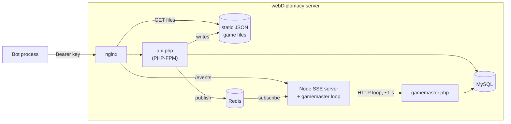
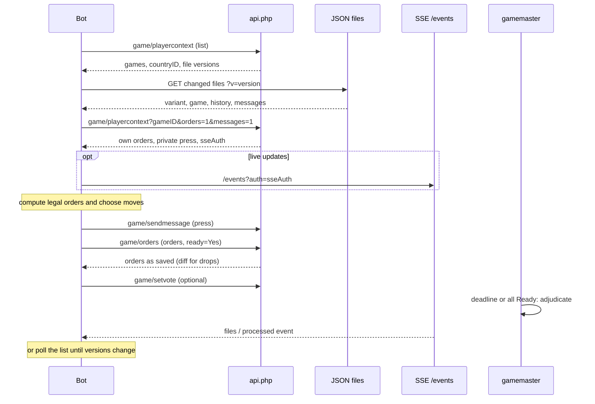

# The webDiplomacy Bot API: How a Bot Plays and Talks to the Server

Reference for the unmodified upstream bot API that players in this Coworld use. It describes kestasjk/webdiplomacy at `bafb2f80` (2026-09-22), the revision pinned by the `webdiplomacy/` submodule. Citations such as `webdiplomacy/api.php:924-927` are paths from the repository root into that submodule; recheck them when the submodule moves.

For the Coworld-specific contract (hello, launcher, deadlines, scoring, artifacts) see [protocol.md](protocol.md). For a working bot, start with [Write your own policy](write-a-policy.md).

## Executive summary

A webDiplomacy ("webDip") bot is an ordinary site account with an API key. It sends every request to one PHP file, `api.php`, with the header `Authorization: Bearer <key>`. Public game state is a set of static JSON files. Private state comes from one call, `game/playercontext`. The bot reads the files, works out its own orders, and acts through three kinds of write call: orders, messages and votes. The server has no route that lists legal orders and no route that creates a normal game. Live updates over server-sent events (SSE) are optional. Polling works.

Five behaviours matter most for a Coworld. First, the server drops invalid orders without an error and still returns 200 (`webdiplomacy/api.php:1040-1078`). Second, an unknown API key gets an empty 200, not a 401 (`webdiplomacy/api.php:1353-1354`). Third, votes from `Bot`-type accounts do not count, and a game with only `Bot`-type players is drawn at the next phase change (`webdiplomacy/gamemaster/gamemaster.php:490`; `webdiplomacy/gamemaster/game.php:883-898`). Fourth, API keys read a redacted copy of private messages unless a config flag is on (`webdiplomacy/api/responses/player_context.php:344-345`). Fifth, games advance only while webDip's Node process runs its gamemaster loop (`webdiplomacy/sse-server/server.js:360-384`). Section 11 shows how this Coworld handles each one.

## Contents

1. [Diplomacy terms you need](#1-diplomacy-terms-you-need)
2. [How the server is put together](#2-how-the-server-is-put-together)
3. [Who a bot is: accounts and API keys](#3-who-a-bot-is-accounts-and-api-keys)
4. [Reading a game](#4-reading-a-game)
5. [Submitting orders](#5-submitting-orders)
6. [Press and votes](#6-press-and-votes)
7. [Live updates over SSE](#7-live-updates-over-sse)
8. [When a bot misses a deadline](#8-when-a-bot-misses-a-deadline)
9. [A bot's life cycle](#9-a-bots-life-cycle)
10. [What a bot can and cannot do](#10-what-a-bot-can-and-cannot-do)
11. [How this Coworld uses these facts](#11-how-this-coworld-uses-these-facts)
- [Appendix A: Route reference](#appendix-a-route-reference)
- [Appendix B: Order fields](#appendix-b-order-fields)
- [Appendix C: Compatibility with older bots](#appendix-c-compatibility-with-older-bots)
- [Appendix D: Sources](#appendix-d-sources)

## 1. Diplomacy terms you need

- Seven **countries** (also called powers) move **units** (armies and fleets) on a map of **territories**.
- 34 territories are **supply centers (SCs)**. A country that owns 18 wins alone.
- Play moves in **phases**. Each phase has a **deadline**. All orders are resolved together at that point.
- **Press** means negotiation by message.

Diplomacy has no dice and no turn order. In each phase, every country secretly writes one **order** per unit. The server then resolves all orders at once. This step is called **adjudication**. webDip has three kinds of playable phase. In **Diplomacy** phases, units move, hold, support or convoy. In **Retreats** phases, units that were forced out retreat or disband. In **Builds** phases, countries add or remove units so that their unit count matches their SC count. Two Diplomacy phases, Spring and Autumn, make one game year.

The **press type** of a game sets who can message whom. `Regular` allows private and public messages. `PublicPressOnly` allows only messages to everyone. `NoPress` allows none (`webdiplomacy/api.php:1158-1165`). A game ends when one country wins alone, or when all remaining players vote for a **draw**.

## 2. How the server is put together

- The API is one PHP file, `api.php`. It uses MySQL for game state and Redis for caches and events.
- Public game data goes into static JSON files. The web server (nginx) serves them straight from disk.
- A small Node.js process serves live updates at `/events`. The same process also drives game processing, which webDip calls "the gamemaster".



Figure 1 — The pieces a bot touches. Game processing depends on the Node process, which calls `gamemaster.php` in a loop.

A bot talks HTTP to the site, and nginx routes each request. Calls to `api.php` go to PHP. File URLs go straight to disk. `/events` goes to the Node server (`webdiplomacy/phpdocker/nginx/nginx.conf:22-28`). About once a second, the Node process sends one HTTP request to `gamemaster.php`. That request processes every game whose deadline has passed or whose players are all ready (`webdiplomacy/sse-server/server.js:360-384, 476-491`). If the Node process stops, no game advances.

Errors come back as plain text with an HTTP status such as 400, 403 or 404 (`webdiplomacy/api.php:57-66, 1800-1828`).

## 3. Who a bot is: accounts and API keys

- A bot is a normal user account. An API key maps to that account.
- The key identifies a **user**, not a seat. The server finds the bot's country from its membership in the game.
- Only the site administrator can issue a key. No route creates one.

Every request carries `Authorization: Bearer <key>` (`webdiplomacy/api.php:96-105`). A request with no key gets 401. A key that matches no account gets an empty response with status 200, because the code that raises the 401 is commented out (`webdiplomacy/api.php:1353-1354`). The bot then sees a JSON parse error. Meta's CICERO bot treats that as a temporary error and retries (`webdiplomacy/doc/gamedata/audit/cicero-dora-bots.md:59-60`). A wrong key therefore looks like a flaky server.

The server never trusts the country in a request. It checks that the caller controls the country it names (`webdiplomacy/api/responses/player_context.php:39-40`; `webdiplomacy/api.php:932, 1167-1169, 471-474`).

An account has a **type**. The two types that matter here are `User` and `Bot` (`webdiplomacy/objects/user.php:584-600`). The type changes server behaviour. Only `User` accounts can join or leave a game through the API (`webdiplomacy/api.php:791-793`). Section 6 shows how the `Bot` type affects votes and draws.

## 4. Reading a game

- Public data lives in five static JSON files. They need no key.
- Private data comes from `game/playercontext`: the bot's own orders, private messages and votes.

The API's documented recipe has four steps (`webdiplomacy/api/README.md:23-29`):

1. Call `game/playercontext` with no `gameID`. This lists your games, their file URLs and file versions.
2. Fetch each file whose version changed.
3. Call `game/playercontext?gameID=N&orders=1&messages=1` for your own orders and private messages.
4. Act with `game/orders`, `game/sendmessage` and `game/setvote` or `game/togglevote`.

| File | What a bot gets from it |
|---|---|
| `variant.json` | The map: territories, SCs, home countries, coasts, and which borders armies and fleets can cross (`webdiplomacy/lib/gamefiles.php:905-944`) |
| `game.json` | Game settings, members, current units and territory owners (`webdiplomacy/doc/gamedata/02-spec.md:87-132`) |
| `status.json` | Each country's order status and votes for the current phase (`webdiplomacy/doc/gamedata/02-spec.md:134-152`) |
| `history.json` | Every phase since the start: units, SC owners, and all orders with their results (`webdiplomacy/doc/gamedata/02-spec.md:154-184`) |
| `messages.json` | Messages sent to everyone (`webdiplomacy/doc/gamedata/02-spec.md:186-210`) |

When a file and `game/playercontext` disagree about the turn, phase or deadline, trust `game/playercontext` (`webdiplomacy/doc/gamedata/02-spec.md:271-272`).

Two details catch bots out:

- **The game list shows only games where the bot is still playing.** A country in civil disorder, which the server treats as abandoned (section 8), drops off the list (`webdiplomacy/api/responses/player_context.php:429`). A request for that one game still works.
- **API keys read redacted private messages.** The server reads a redacted copy of the message table unless the config flag `allowBotsAccessToUnredactedMessages` is true (`webdiplomacy/api/responses/player_context.php:344-345`). On the live site, a separate process fills that copy (`webdiplomacy/doc/gamedata/02-spec.md:501-504`).

## 5. Submitting orders

- When a phase starts, the server makes one default order for each unit. A bot overwrites these orders. It never adds new ones.
- `game/orders` sends all of a country's orders in one call, with a "ready" flag.
- The server drops invalid orders without an error.
- No route lists legal orders. The bot works them out itself.

**Default orders.** At the start of a Diplomacy phase, the server writes a `Hold` order for each unit (`webdiplomacy/gamemaster/orders/diplomacy.php:161-171`). Retreats and Builds phases get similar defaults. A bot that sends nothing therefore holds every unit and builds nothing.

**The request.** A bot sends `POST api.php?route=game/orders` with a JSON body (`webdiplomacy/api.php:867-873`):

```json
{ "gameID": 5, "turn": 3, "phase": "Diplomacy", "countryID": 2, "ready": "Yes",
  "orders": [ { "terrID": 17, "type": "Move", "fromTerrID": null, "toTerrID": 22, "viaConvoy": "No" } ] }
```

`turn` and `phase` must match the game's current values. If they do not, the server returns 400 (`webdiplomacy/api.php:924-927`). Each order must include all five keys, even when a value is null (`webdiplomacy/api.php:977-989`). The server finds the unit by its territory ID, `terrID`. Appendix B lists the fields for each order type.

**The silent drop.** The server checks every order in the batch. It removes each invalid order and checks the rest again, until only valid orders remain (`webdiplomacy/api.php:1040-1078`). It then saves those orders and returns 200 with the country's current orders (`webdiplomacy/api.php:1080-1128`). A unit whose order was dropped keeps its old order, which is often the default Hold. The response has no error field. To find a dropped order, the bot must compare what it sent with what came back.

**Ready.** `ready: "Yes"` tells the server the country is done. If the field is missing, the old value stays (`webdiplomacy/api.php:1082`). The API accepts Ready even when some orders are missing. A phase ends at its deadline, or earlier when every playing country is Ready (`webdiplomacy/gamemaster/gamemaster.php:522-566`). Bots count in this check.

**Legal orders.** No route lists them. The web board works them out in the browser, for the Classic map only (`webdiplomacy/game-src/src/utils/state/gameApiSlice/extraReducers/fetchGameData/precomputeLegalOrders.ts:1-60`). A new bot can build the map from `variant.json`. That file comes from the same border tables the server uses to check orders (`webdiplomacy/lib/gamefiles.php:930-944`; `webdiplomacy/board/orders/diplomacy.php:244-281`).

## 6. Press and votes

- `game/sendmessage` sends a message. `toCountryID` 0 means everyone. Any other value means one country.
- Votes from `Bot`-type accounts do not count.

**Messages.** `game/sendmessage` takes JSON with `gameID`, `countryID`, `toCountryID` and `message` (`webdiplomacy/api.php:1135-1137`). The press type decides whether a message is allowed (section 1). The server stores the text with HTML escaping and caps it at 65,000 bytes (`webdiplomacy/lib/gamemessage.php:51, 62-65`). The API has no rate limit on messages. A bot can read only the private messages that its own country sent or received (`webdiplomacy/api/responses/player_context.php:348-353`).

**Votes.** A player can vote for `Draw`, `Pause`, `Cancel` or `Concede` with `game/setvote` or `game/togglevote` (`webdiplomacy/api.php:457-581`). A vote passes only when every playing member **that is not a `Bot`-type account** votes for it (`webdiplomacy/gamemaster/gamemaster.php:470-500`). So bot votes have no effect. There is a second rule. If every playing member is a `Bot`-type account, the server draws the game at the next phase change (`webdiplomacy/gamemaster/game.php:883-898`). The one exception is a game whose player type is `Members`. On the live site, this rule ends a human-against-bots game once the human is out.

## 7. Live updates over SSE

- SSE is a one-way stream of events from the server to a browser or bot.
- SSE is optional. Existing bots poll instead.

`game/playercontext` returns a token, `sseAuth`, that is valid for one day. A client opens `/events` with that token and a list of channels for one game (`webdiplomacy/sse-server/server.js:207-248`). The channels carry "phase processed", "vote changed", "new message" and "new file version" events (`webdiplomacy/doc/gamedata/02-spec.md:336-347`). The spec says plainly that bots which do not use SSE get the same file versions from the game list (`webdiplomacy/doc/gamedata/02-spec.md:354`). CICERO and Dora never use SSE (`webdiplomacy/doc/gamedata/audit/cicero-dora-bots.md:36`).

## 8. When a bot misses a deadline

- In a normal game, a missed deadline delays the phase for everyone. After too many misses, the country goes into **civil disorder**: the server treats it as abandoned.
- In a human-against-bots game (player type `MemberVsBots`), none of this happens. A silent country's units simply hold.

A country that has units but has not saved orders at the deadline has missed it (`webdiplomacy/gamemaster/game.php:600-608`). In a normal game, the server then extends the phase and clears every player's Ready flag. Each country gets a small number of such "excused" misses. After that, the country goes into civil disorder (`webdiplomacy/gamemaster/members.php:655-680`). Its units keep their default orders, and it drops off the bot's game list (section 4). If the bot later submits orders, the country returns to play (`webdiplomacy/api.php:932-942`). In a `MemberVsBots` game, the server skips all of this (`webdiplomacy/gamemaster/game.php:596-597`).

## 9. A bot's life cycle

- The loop is: find games, read, decide, write, wait for the phase to end, repeat.



Figure 2 — One phase from a bot's point of view. Every call to `api.php` carries the API key. File fetches carry none.

A well-behaved bot works in five steps:

1. **Find games.** It lists its games, its country and the file versions (`webdiplomacy/api/responses/player_context.php:448-468`).
2. **Read.** It fetches changed files, then its own orders and new private messages. It keeps `variant.json`, which almost never changes (`webdiplomacy/lib/gamefiles.php:873-890`).
3. **Decide.** It works out the legal orders and picks its moves. An LLM bot usually negotiates by press first.
4. **Act.** It sends press, then its orders with `ready: "Yes"`. It compares the response with what it sent.
5. **Wait.** It waits for a new file version, through SSE or by polling. Then it goes back to step 2. It stops when the game leaves its list.

## 10. What a bot can and cannot do

- A bot can do what a human player can do in its own seat. It cannot create games or see hidden information.
- The biggest gaps are: no legal-order route, no error for an invalid order, and no weight for `Bot`-type votes.

| Capability | Bot can? | Detail |
|---|---|---|
| See the full public board, history and map | Yes | Static files, no key needed (`webdiplomacy/api/README.md:14-17`) |
| See its own orders, votes and private press | Yes | Private press is redacted unless the config flag is on (`webdiplomacy/api/responses/player_context.php:344-345`) |
| See other countries' private press or current orders | No | Only its own messages, and only finished phases are in `history.json` (`webdiplomacy/doc/gamedata/02-spec.md:432`) |
| Ask the server for legal orders | No | No route. Work them out from `variant.json`. |
| Get an error for an invalid order | No | Dropped silently. Compare the response. (`webdiplomacy/api.php:1040-1078`) |
| Send public and private press | Depends on press type | (`webdiplomacy/api.php:1158-1165`) |
| Have its votes counted | Not as a `Bot`-type account | (`webdiplomacy/gamemaster/gamemaster.php:490`) |
| Create a game | No | Humans create bot games on a web page (`webdiplomacy/botgamecreate.php:314-349`) |
| Play maps other than Classic | No | Only variants 1, 15 and 23 by default (`webdiplomacy/config.sample.php:259-268`) |
| Be rate-limited | No | Only browser telemetry routes have limits (`webdiplomacy/api.php:1439-1461`) |

## 11. How this Coworld uses these facts

The game container runs this API unchanged; [design.md](design.md) explains why. The findings above drive these settings:

- **Unredacted private press.** No redaction process runs, so `config/webdip.php` sets `allowBotsAccessToUnredactedMessages` to true (section 4).
- **Seat accounts and game type.** `php/wdc_create_game.php` creates seven `User`-type accounts in an Unranked `MemberVsBots` game. Votes therefore count, no forced all-bot draw applies (section 6), and a silent seat's units hold without extending the phase (section 8).
- **One API key per seat.** Each seat's Coworld token is its webDip API key. A wrong key fails silently (section 3), so `php/wdc_create_game.php` stores every seat token in `wD_ApiKeys` before any player connects, and the launcher passes the key from the hello message to the bot as `WEBDIP_API_KEY`.
- **Upstream game processing.** The adapter supervises the upstream Node SSE server, which drives `gamemaster.php` as on the live site (section 2). The adapter never calls `process()` or applies votes.
- **Year cap.** Upstream has no turn limit, so `php/wdc_end.php` ends the game with upstream `setDrawn()` (`webdiplomacy/gamemaster/game.php:1412-1416`).
- **Classic only.** Bots can play only variant 1 among multiplayer maps (section 10).
- **Order verification.** Because invalid orders are dropped silently (section 5), `players.api.verify_orders` diffs saved orders against requested ones; see [players.md](players.md).

## Appendix A: Route reference

All routes are `api.php?route=<name>`. `JSON` routes read a raw JSON request body. `GET` routes read the query string.

| Route | Type | Params | Returns |
|---|---|---|---|
| `game/playercontext` | GET | `gameID`?, `orders`?, `messages`?, `messagesSince`? | One game's private context, or a list of games when `gameID` is missing (`webdiplomacy/api.php:747-771`) |
| `game/orders` | JSON | `gameID, turn, phase, countryID, orders[], ready` | The country's current orders (`webdiplomacy/api.php:867-1130`) |
| `game/sendmessage` | JSON | `gameID, countryID, toCountryID, message` | `{messages:[...]}` (`webdiplomacy/api.php:1135-1209`) |
| `game/setvote` | JSON | `gameID, countryID, vote, voteOn` | The country's votes (`webdiplomacy/api.php:521-581`) |
| `game/togglevote` | GET | `gameID, countryID, vote` | The country's votes (`webdiplomacy/api.php:457-512`) |
| `game/join`, `game/leave` | POST | `gameID` | `{msg, success}` (`webdiplomacy/api.php:776-861`) |

## Appendix B: Order fields

| Type | Required fields (all five keys must be present) |
|---|---|
| `Hold` | `type, terrID` |
| `Move` | `type, terrID, toTerrID, viaConvoy` (+ `convoyPath` when convoyed) |
| `Support hold` | `type, terrID, toTerrID` |
| `Support move` | `type, terrID, fromTerrID, toTerrID` |
| `Convoy` | `type, terrID, fromTerrID, toTerrID` |
| `Retreat` | `type, terrID, toTerrID` |
| `Disband` | `type, terrID` |
| `Build Army` / `Build Fleet` | `type, terrID, toTerrID` |
| `Wait` | `type` (in Builds, sets every free build to Wait) |
| `Destroy` | `type, terrID, toTerrID` |

The table follows the API README and the order code (`webdiplomacy/api/README.md:137-152`; `webdiplomacy/api.php:977-1038`). An unknown `terrID` returns 400. It is not dropped silently (`webdiplomacy/api.php:1008-1017`). A convoyed move must list the chain of territories it passes through. The server checks that chain but does not work it out (`webdiplomacy/board/orders/diplomacy.php:136-170`).

## Appendix C: Compatibility with older bots

On 2026-09-20, webDip replaced its old read routes with the static files and `game/playercontext`. The write routes did not change (`webdiplomacy/api/README.md:227-236`). A bot that calls an old route now gets 404. The spec warns that the live CICERO and Dora bots stop working until they move to the new routes (`webdiplomacy/doc/gamedata/02-spec.md:596-599`). The popular Python `diplomacy` package also calls removed routes (`webdiplomacy/doc/gamedata/audit/gunboat-bots.md:21-28`). So "unmodified webDip bots" means bots written for the API after 2026-09-20. The repository does not show whether webdiplomacy.net runs the new API yet (`webdiplomacy/doc/gamedata/02-spec.md:3-4`).

## Appendix D: Sources

webDiplomacy (`webdiplomacy/` submodule at `bafb2f80`):

- `webdiplomacy/api.php`
- `webdiplomacy/api/README.md`
- `webdiplomacy/api/responses/player_context.php`
- `webdiplomacy/lib/gamefiles.php`
- `webdiplomacy/lib/gamemessage.php`
- `webdiplomacy/config.sample.php`
- `webdiplomacy/doc/gamedata/02-spec.md`
- `webdiplomacy/doc/gamedata/audit/cicero-dora-bots.md`
- `webdiplomacy/doc/gamedata/audit/gunboat-bots.md`
- `webdiplomacy/gamemaster/gamemaster.php`
- `webdiplomacy/gamemaster/game.php`
- `webdiplomacy/gamemaster/members.php`
- `webdiplomacy/gamemaster/orders/diplomacy.php`
- `webdiplomacy/board/orders/diplomacy.php`
- `webdiplomacy/game-src/src/utils/state/gameApiSlice/extraReducers/fetchGameData/precomputeLegalOrders.ts`
- `webdiplomacy/objects/user.php`
- `webdiplomacy/botgamecreate.php`
- `webdiplomacy/sse-server/server.js`
- `webdiplomacy/phpdocker/nginx/nginx.conf`
